#Accounts and users

GeoNode is primarily a social platform, and thus a primary component of any GeoNode instance is the user account. This section will guide you through account registration, updating your account information, and viewing other user accounts.

#Creating a new account
Before you can save or edit any layers on a GeoNode instance, you need to create an account.

1. From any page in the web interface, you will see a Sign in link. Click that link, and in the dialog that displays, click the Register now link.

	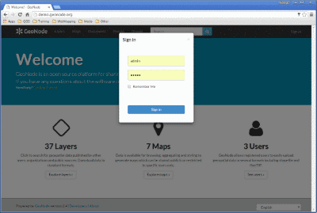

2. On the next page, fill out the form. Enter a user name and password in the fields. Also, enter your email address for verification.

	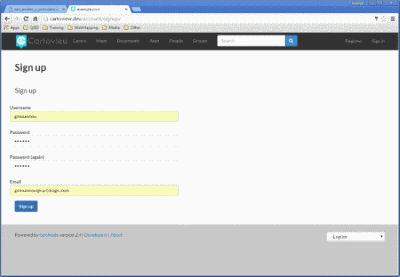

3. You will be returned to the welcome page. An email will be sent confirming that you have signed up. While you are now logged in, you will need to confirm your account. Navigate to the link that was sent in the email.

	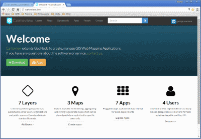

4. Click Confirm. You will be returned to the homepage.

#Managing your profile
Your profile contains personal information.

1. Click on your user name in the top right of the screen. A drop-down list will show. Click on Profile to enter the Profile settings page.

	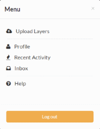

2. The next page shows your profile, which is currently empty.

	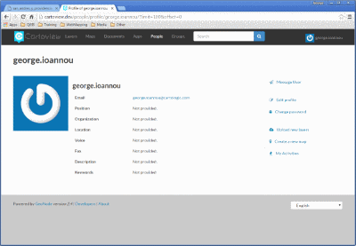

3. Click the Edit profile information link.

	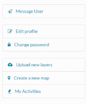

4. On this page, your personal information can be set, including your avatar. Enter some details in the Profile box as well as your city and country info.

	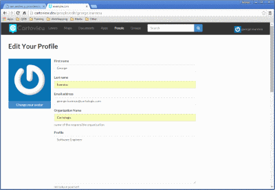

5. When finished, click Update profile.

	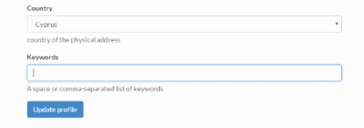

6. From the profile page you can also change your password. Just click on the Change Password link and the relevant form will appear.

	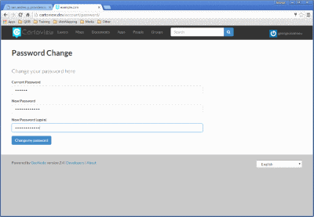

7. When finished, click Change my Password to save changes and return to the profile page.

#Viewing other user accounts

1. Now that your account is created, you can view other accounts on the system. To see information about other users on the system, click the People link on the top toolbar. You will see a list of users registered on this system.

	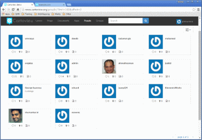
	
2. Click on the user name for a particular user. You will see the user's profile.
	
	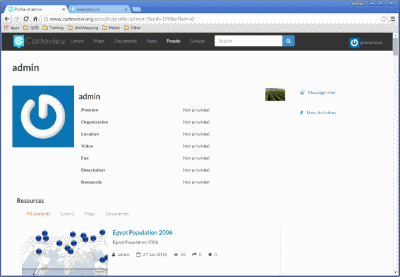

3. You can also click Activities to see the activity feed.

	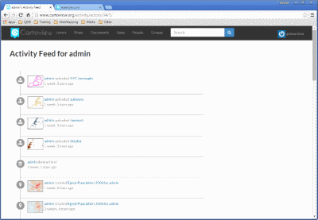

4. Click the Layers tab at the bottom of the page to preview layers uploaded by this user.

	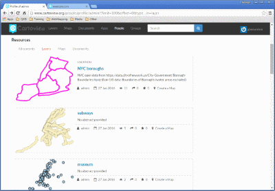

5. You can also click the Maps tab to preview maps owned by this user.

	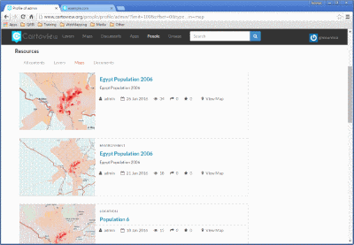

6. Finally, you can click the Documents tab to preview documents owned by this user.

	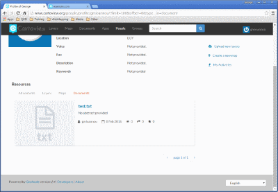