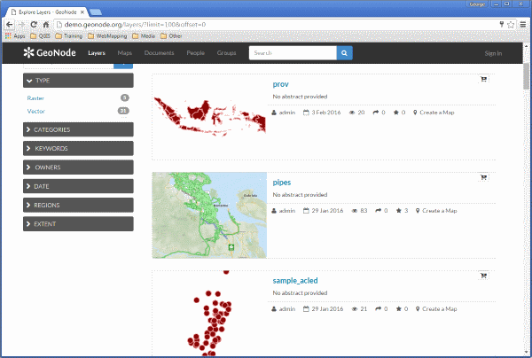

##What is GeoNode?

GeoNode is a geospatial content management system, a platform for the management and publication of geospatial data. It brings together mature and stable open-source software projects under a consistent and easy-to-use interface allowing non-specialized users to share data and create interactive maps.

Data management tools built into GeoNode allow for integrated creation of data, metadata, and map visualizations. Each dataset in the system can be shared publicly or restricted to allow access to only specific users. Social features like user profiles and commenting and rating systems allow for the development of communities around each platform to facilitate the use, management, and quality control of the data the GeoNode instance contains.

It is also designed to be a flexible platform that software developers can extend, modify or integrate against to meet requirements in their own applications.

##A tour of GeoNode

In order to get started, let’s look at the GeoNode interface and get a feel on how to navigate around.

The GeoNode web interface is the primary method of interacting with GeoNode as a user. From this interface, one can view and modify existing spatial layers and maps, as well as find information on other GeoNode users.

Without being logged in, you are limited to read-only access of public layers.

1. Navigate to you your GeoNode instance, available here:

	

	This page shows a variety of information about the current GeoNode instance. At the top of the page, a toolbar exists showing quick links to view layers, maps, documents (metadata), people ADD LINK, and a search field. Below this is a listing of recently updated layers, including abstract, owner, rating, and download button (if available).

2. Click the Layers link in the toolbar to go to the Explore Layers page.

	

	This page shows all layers known to GeoNode, available in either List or Grid viewing. Layers can be sorted by Most Recent, Most Popular, or Most Shared. Also available are a list of categories, with which layers can be connected with.

3. Find a layer and click on its name.

	

4. A layer viewing page will display, with the layer itself superimposed on a hosted base layer (in this case [MapQuest OpenStreetMap](http://open.mapquest.com/)). Explore this page, noting the various options available to you.

5. Now click the Maps link in the tool bar to go to the Explore Maps page.

	

	This page shows all maps known to GeoNode, available with similar viewing options as with the layers.

6. Type San Andres in the Search Box at the top of the page and hit Enter.

	

	>>This page contains a wealth of options for customizing a search for various information on this GeoNode instance. While a simple search box is available at the top of every page, this search from allows for much more fine-tuned searches.
	Now that you are familiar with the basic interface, the next step is to create your own account so you manage some GeoNode resources of your own.