#Managing Layers
After user accounts, the next primary component of GeoNode is the layer. Layers are a published resource representing a raster or vector spatial data source. Layers also can be associated with metadata, ratings, and comments.

In this section, you will learn how to create a new layer by uploading a local data set, add layer info, change the style of the layer, and share the results.

#Uploading a layer
Now that we have taken a tour of GeoNode and viewed existing layers, the next step is to upload our own.

In your data pack is a directory called ```data```. Inside that directory is a shapefile called ```san_andres_y_providencia_administrative.shp```. This is a data set containing ... This will be the first layer that we will upload to GeoNode.

1. Navigate to the GeoNode welcome page.
2.Click the Layers link on the top toolbar. This will bring up the Layers menu.

	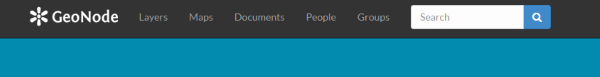

	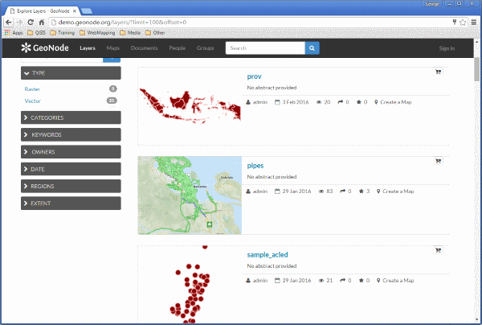

3. Click Upload Layers in the Layers toolbar. This will bring up the upload form

	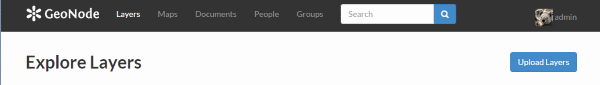
	
	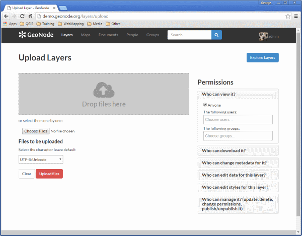

4. Fill out the form.

	Click the Choose Files button. This will bring up a local file dialog. Navigate to your data folder and select the ```san_andres_y_providencia_administrative.*``` files.
	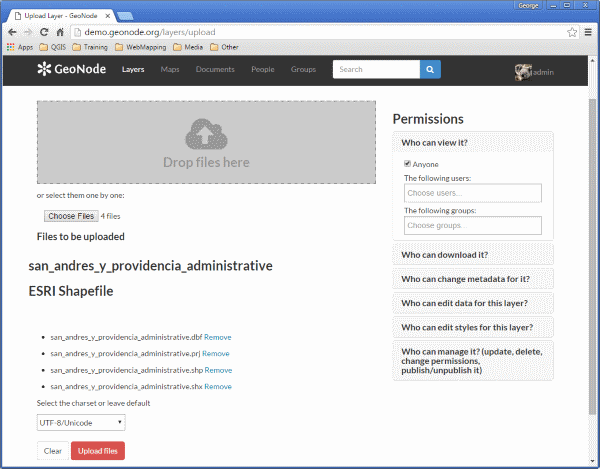

5. GeoNode has the ability to restrict who can view, edit, and manage layers. On the right side of the page, under Who can view and download this data, select Any registered user. This will ensure that anonymous view access is disabled.
In the same area, under Who can edit this data, select your username. This will ensure that only you are able to edit the data in the layer.
	
	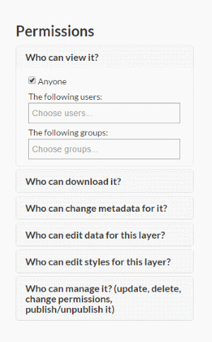

6. Click Upload to upload the data and create a layer. A dialog will display showing the progress of the upload.
	
	

Your layer has been uploaded to GeoNode.

#Layer information
After upload, click Edit Metadata to update metadata about the layer. Change any information as desired, and then click Update at the very bottom of the form.

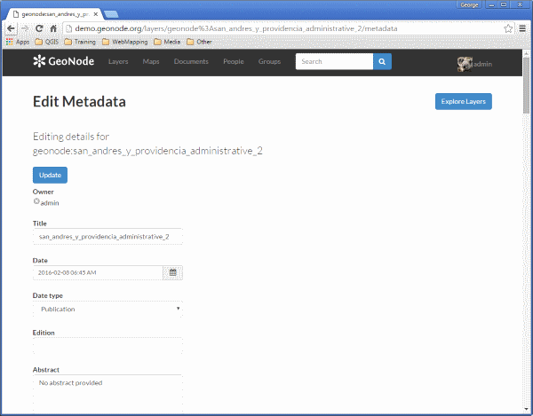

After the update, the layer will display in a preview window.

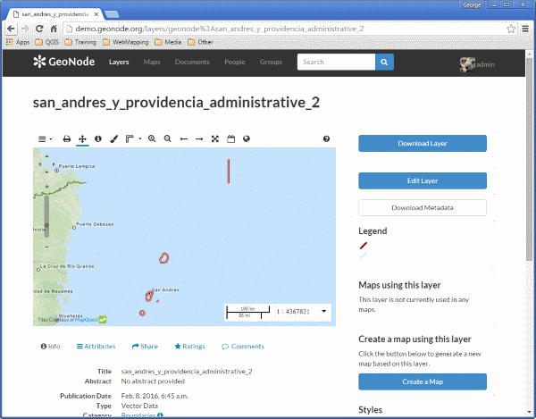

This page contains lots of options for managing this layer. Let's look at a few of them:

#Downloads

At the top right corner of the page there are two buttons titled Download Layer and Download Metadata. These buttons provide access to the ability to extract geospatial data and metadata from within GeoNode. In this way, GeoNode allows for two way data access; one can import as well as export data.

1. Click the Download Layer button. You will see a list of options of the supported export formats.

	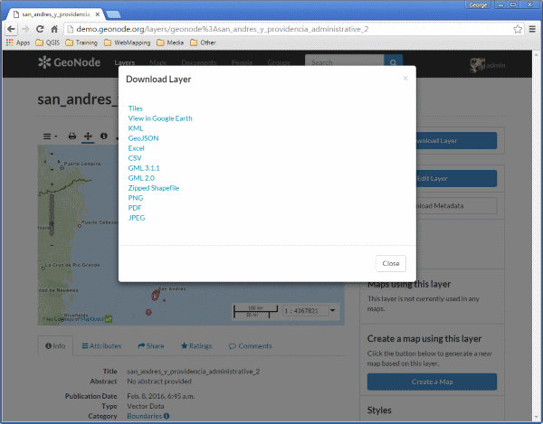

2. Click the option for Zipped Shapefile.
3. GeoNode will process the request and bring up a Save As dialog. Save this file to your computer, and note how it is the same content as was uploaded.
#Metadata

1. Scroll down the page toward the bottom. Five tabs are available: Info, Attributes, Share, Ratings, and Comments. The info tab is already highlighted, and presents basic information about the layer, of the kind that was seen on the layer list page.

	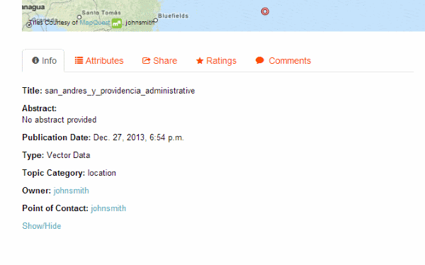

2. Click the Attributes tab. This lists the attributes of the layer, including statistics such as mean and standard deviation (where applicable).
3. Click the Ratings tab. This tab allows you (and others viewing this page) to rate this layer. Ratings can be based on quality, accuracy, or any other metric. Click on the appropriate star to rate this layer.

	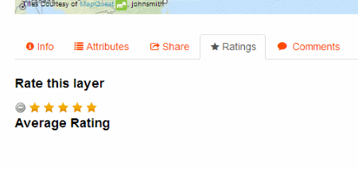

4. Click the Comments tab. This tab allows you to leave a comment for other viewing this layer.

	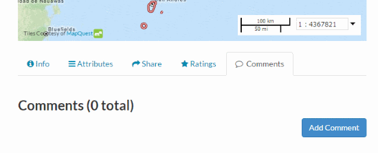

5. Click the Add Comment button and enter a comment.

	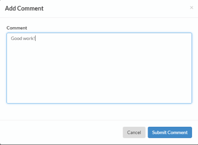

6. When finished, click Submit Comments

	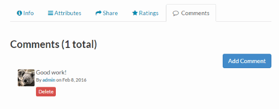

#Sharing layers
GeoNode has the ability to restrict or allow other users to access a layer.

#Anonymous access
1. Go to the layer preview of the first layer uploaded, and copy the URL to that preview page.

	> **Note**

	>> The URL should be something like: ```http://demo.geonode.org/layers/geonode%3Asan_andres_y_providencia_administrative```

2. Now log out of GeoNode by clicking on your profile name and selecting Log out.
	
	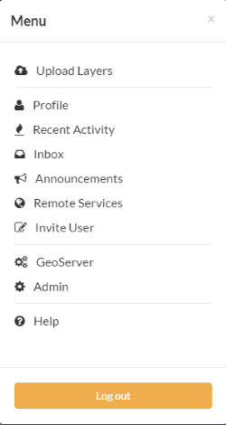

3. Now paste the URL copied about into your browser address bar and navigate to that location.
4. You should be redirected to the login page. This is because when this layer was first uploaded, we set the view properties to be any registered user. Once logged out, we are no logner a registered user and so are not able to see or interact with the layer.

	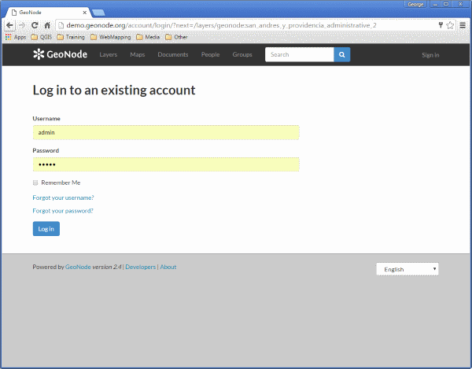

#Adding more layers
We've uploaded one layer so far. There is one more layer in the data directory associated with this workshop called ```san_andres_y_providencia_poi.shp```.

- Upload this layer, referring to the directions on [uploading a layer](managing.md#uploading-a-layer). As a difference, leave the permissions set to their default values.
	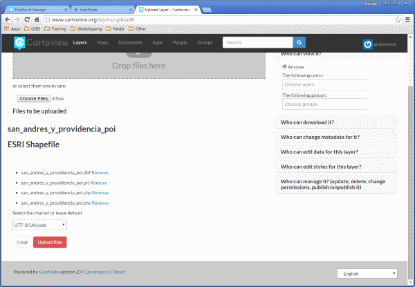

	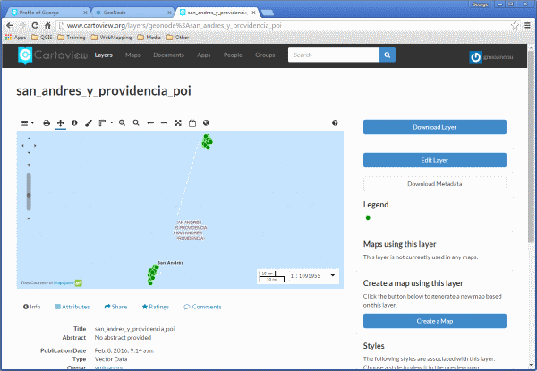
