#Managing Maps

The next primary component of GeoNode is the map. Maps are comprised of various layers and their styles. The Layers can be either local, served by the local GeoServer or remote, served by other map service providers such as Open Street Map, Google, Bing or MapQuest.

The GeoNode Map viewer provides tools for map navigation, layers management, ordering and styling, identifying features, etc.

In this section, we will create a map based on the layers uploaded in the previous section, combine them with some existing layers and a remote web service layer, and then share the resulted map for public viewing.

#Creating a map
##Adding layers
1. Click the Maps link on the top toolbar. This will bring up the list of maps.
	
	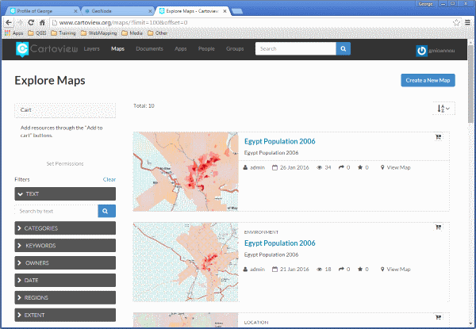

2. Click the Create a New Map button to launch the map composition interface.

	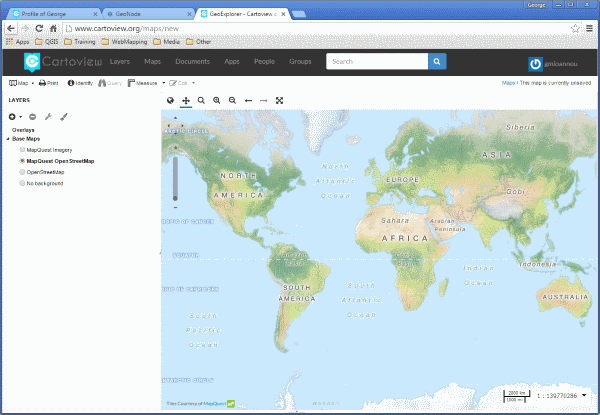


	In this interface there is a toolbar, layer list, and map window. The map window contains the MapQuest OpenStreetMap layer by default. There are other service layers available here as well: Blue Marble, Bing Aerial With Labels, MapQuest, and OpenStreetMap.

3. Click on the New Layers button and select Add Layers.
	
	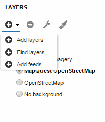

3. Select all of the San Andreas layers by clicking the top entry and Shift-clicking the bottom one. Click Add Layers to add them all to the map.
	
	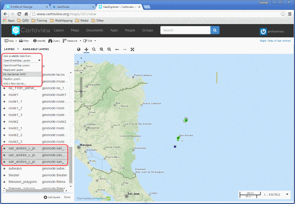

	> **Note**

	>> This selection includes not only the two layers uploaded in the previous section, but also the layers that were already hosted on GeoNode at the beginning of the workshop.

5. The layers will be added to the map. Click Done (right next to Add Layers at the bottom) to return to the main layers list.
	
	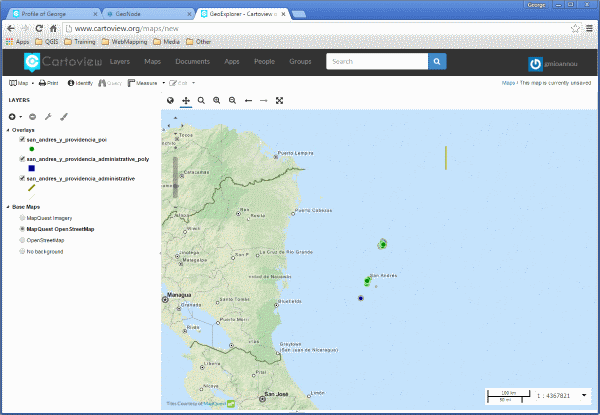

#Saving the map
1. While we still have some work to do on our map, let's save it so that we can come back to it later. Click on the Map button in the toolbar, and select Save Map.
	
	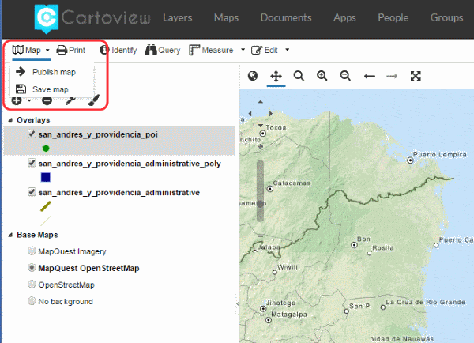

2. Enter a title and abstract for your map.
	
	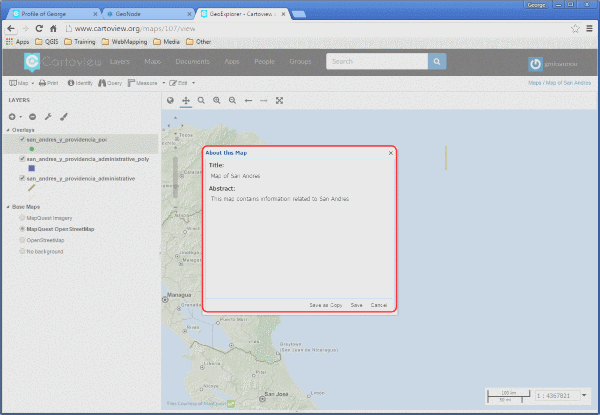

3. Click Save. Notice that the link on the top right of the page changed to reflect the map's name.
	
	

This link contains a permalink to your map. If you open this link in a new window, your map will appear exactly as it was saved.


#Styling layers
In this interface, we can pause in our map creation and change the style of one of our uploaded layers. GeoNode allows you to edit layer styles graphically, without the need to resort to programming or requiring a technical background.

We'll be editing the ```san_andres_y_providencia_poi layer```.

1. In the layer list, uncheck all of the layers except the above, so that only this one is visible (not including the base layer).

	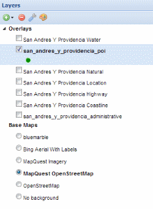

2. Zoom in closer using the toolbar or the mouse.

	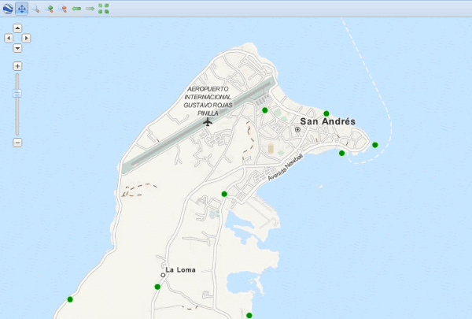

3. In the layer list, click to select the remaining layer and then click the palette icon (Layer Styles). This will bring up the style manager.

	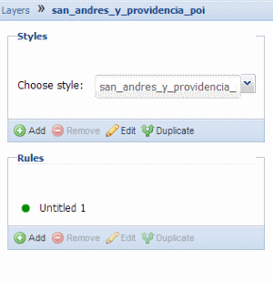

4. This layer has one style (named the same as the layer) and one rule in that style. Click the rule (Untitled 1) to select it, and then click on Edit below it.

	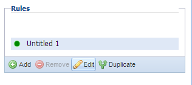


5. Edit the style. You can choose from simple shapes, add labels, and even adjust the look of the points based on attribute values and scale.

	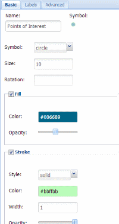

	


6. When done, click Save, then click on the word Layers to return to the layer list.

	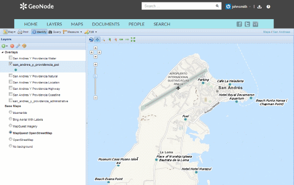

#Share your map
Now let's finish our map.

1. Check the box next to the highway layer to activate it. If it is not below the POI layer in the list, click and drag it down.

	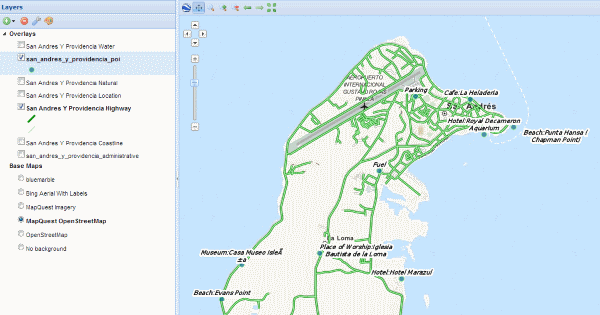

2. Make any final adjustments to the map composition as desired, including zoom and pan settings.
Click the Map button in the toolbar, and then click Publish Map.

	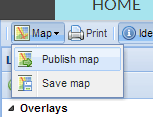

4. The title and abstract as previously created should still be there. Make any adjustments as necessary, and click Save.
5. A new dialog will appear with instructions on how to embed this map in a webpage, including a code snippet. You can adjust the parameters as necessary.

	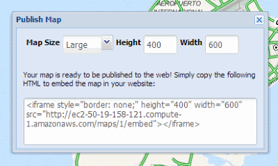

**Your map can now be shared.**
